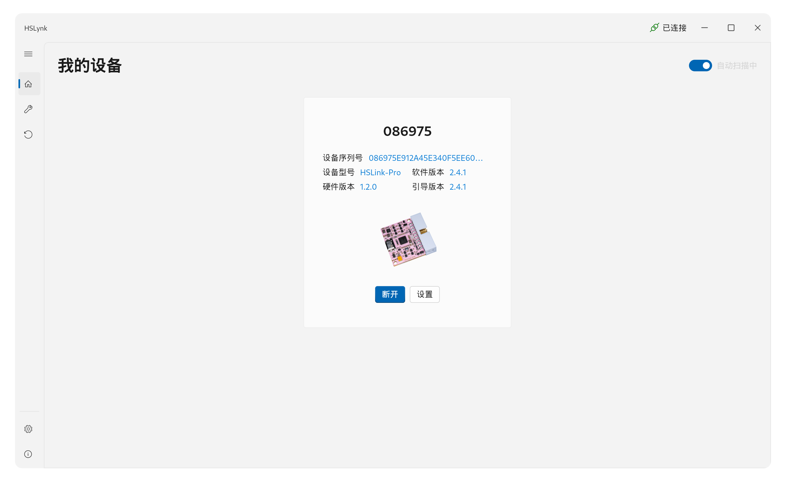
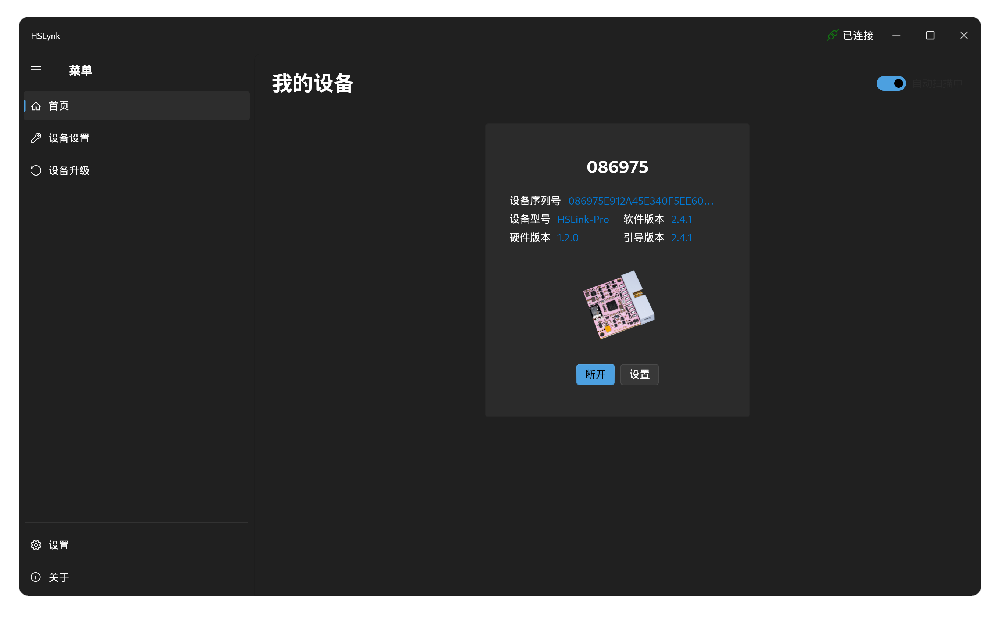
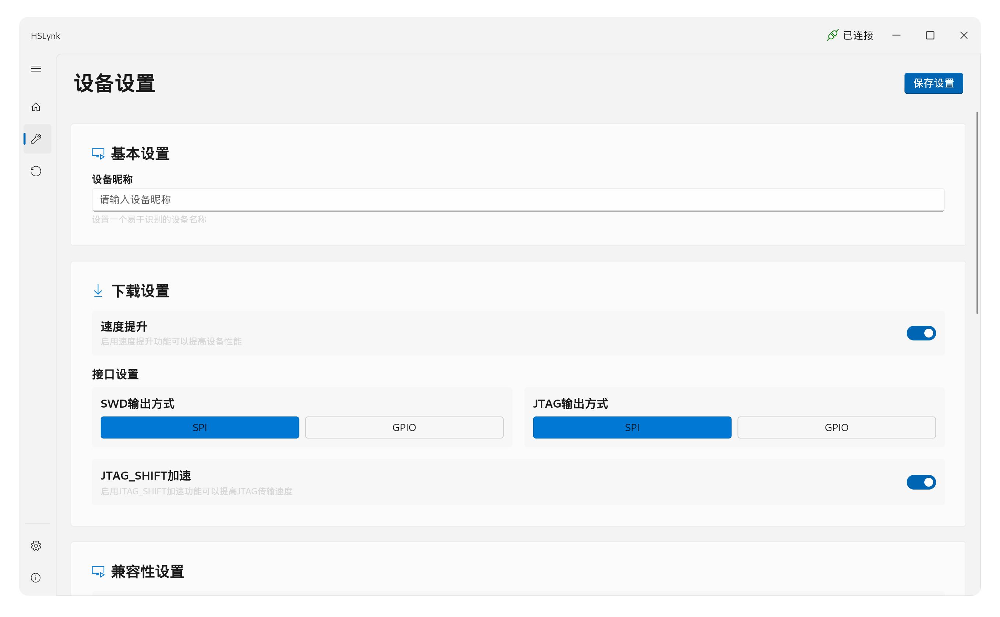
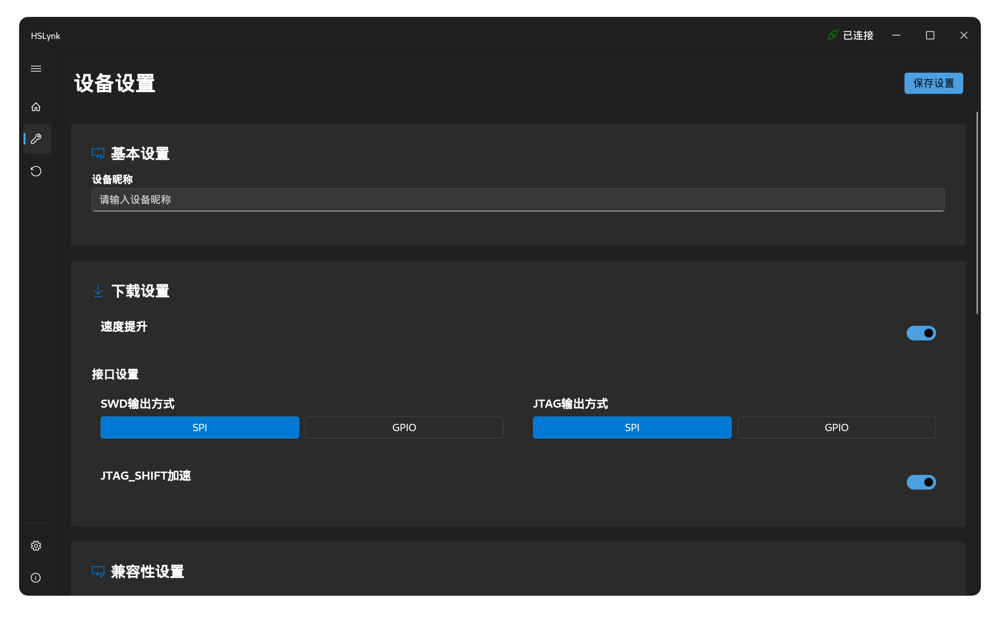
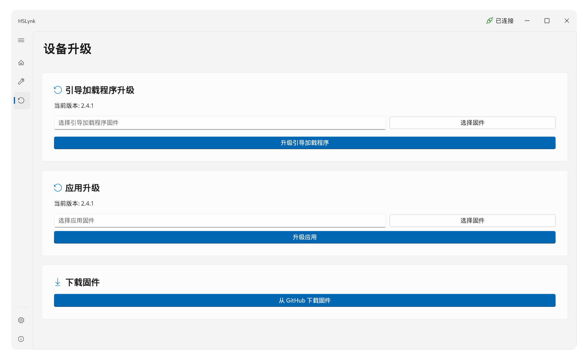
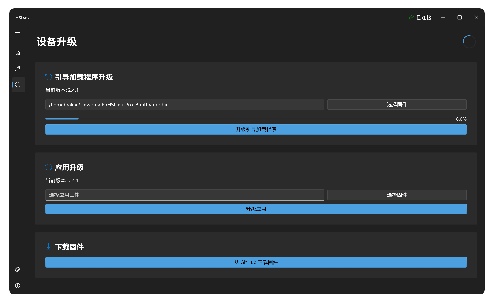
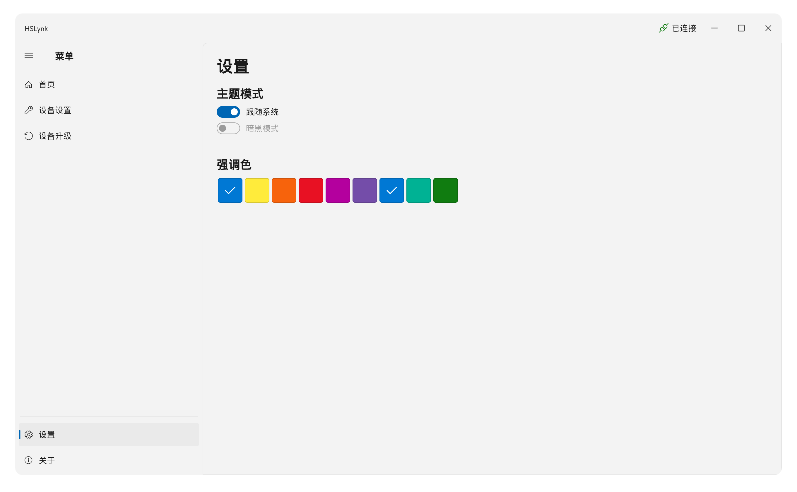
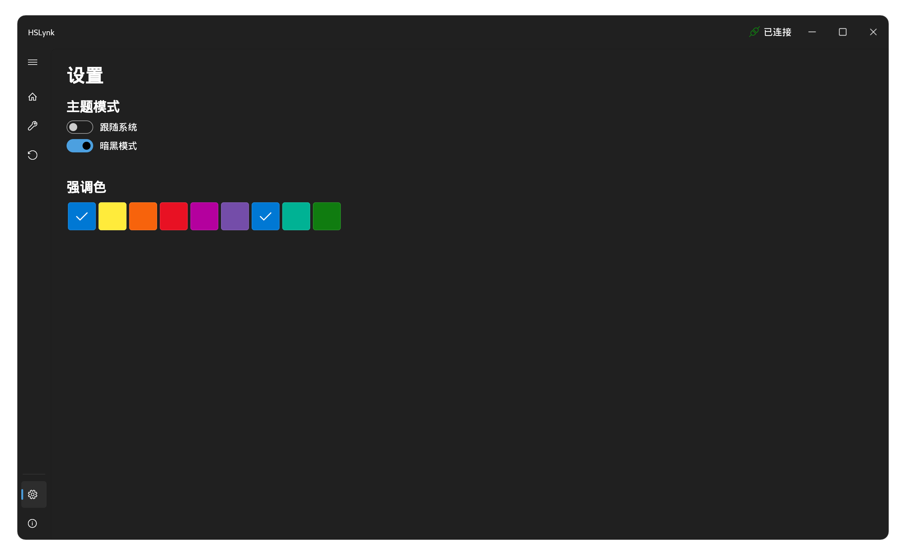
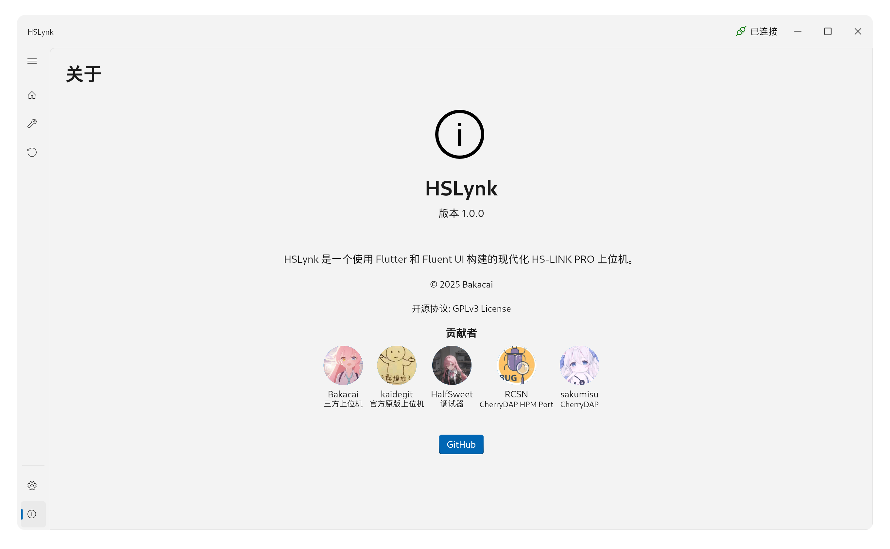
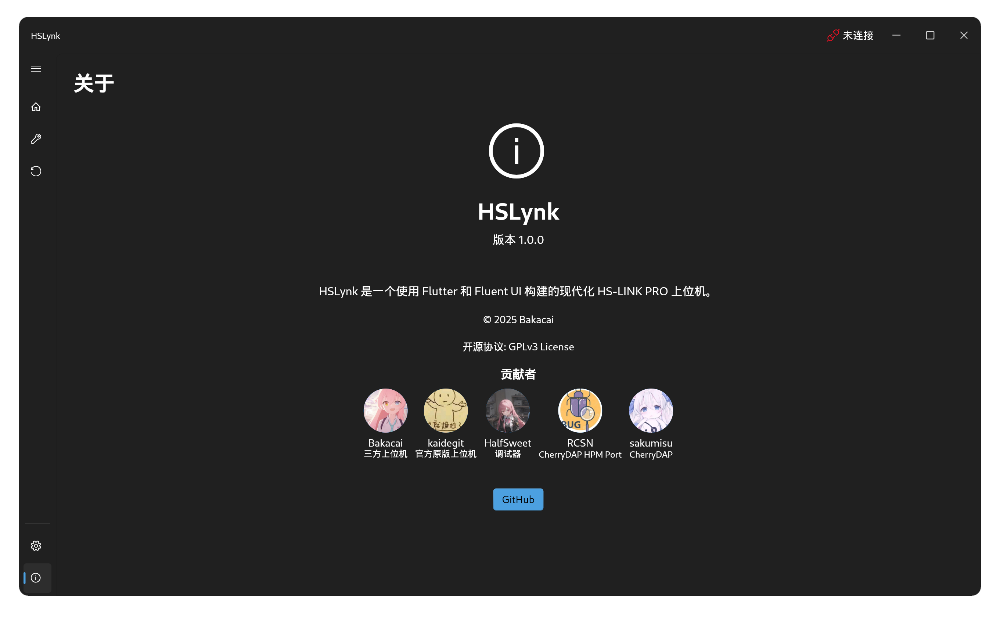

# HSLynk

[HS LINK](https://github.com/HSLink) 三方上位机

## 与官方上位机的异同

[HSLinkNexus](https://github.com/HSLink/HSLinkNexus)是HSLINK项目的官方上位机

- 相同处：
  1. 跨平台，支持Windows、Linux、~~MacOS~~
  2. 通信协议完全一致，兼容官方主板
  3. 实现了原版的所有已有功能

- 不同处：
  1. 修复了Linux下因为**在 Linux 下使用 hidapi 发送 HID 报文时，报文长度必须是固定**而导致的官方上位机在Linux下表现不正常的问题（具体表现在更新bootloader无法成功、连接过之后再断连设备无法被成功读取）
  2. 为bootloader更新添加了进度条
  3. 实现了在linux系统下的uf2更新
  4. 设计风格不同，使用微软Fluent设计风格
  5. 二进制纯原生运行，~~与官方上位机相比少了个浏览器~~

## 目前存在的问题

- [ ] Windows下关闭软件时会卡顿一下
- [ ] 当设备更新时离开页面会报错
- [ ] MacOS编译出现问题，暂时无法获得可用产物
- [ ] 设备昵称设置功能暂不可用（疑似官方上位机也不可用）
- [ ] `JTAG 20帧兼容模式` 设置暂不可用（目前v1.2.1版本下位机固件甚至无法获得相关设置）
- [ ] 部分界面设计不符合Fluent设计规范
- [ ] 没有I18N

## 软件截图

|  界面  |                   浅色模式                   |                        暗黑模式                        |
|:------:|:--------------------------------------------:|:------------------------------------------------------:|
|  首页  |                      |                      |
|设备设置|||
|设备升级|  |  |
|软件设置|              |              |
|软件关于|                    |                    |

## 开源协议

本项目使用了GPLv3协议进行开源，在使用代码时请务必遵守相关开源协议规定。